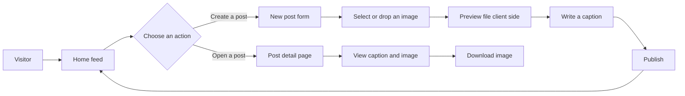
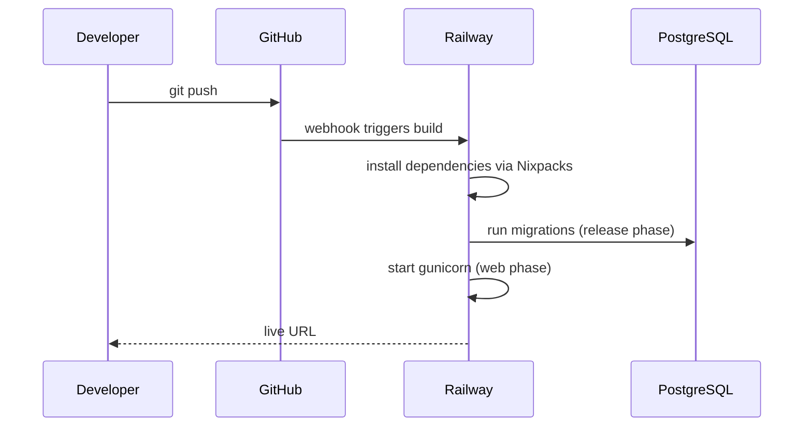

<div align="center">


<br />

**A refined Django image sharing platform with an editorial gallery feed, a polished upload flow, and a luxury dark gold interface.**

[](https://www.djangoproject.com/)
[](https://www.python.org/)
[](https://www.postgresql.org/)
[](https://railway.app/)
[](LICENSE)

<sub>Gallery feed &nbsp;•&nbsp; Editorial detail pages &nbsp;•&nbsp; Drag and drop uploads &nbsp;•&nbsp; Production hardened for Railway</sub>

</div>

<br />

## Table of contents

- [Overview](#overview)
- [Why Luminary](#why-luminary)
- [Interface](#interface)
- [Features](#features)
- [Tech stack](#tech-stack)
- [Architecture](#architecture)
- [Application flow](#application-flow)
- [Project structure](#project-structure)
- [Core model](#core-model)
- [Routes](#routes)
- [Getting started](#getting-started)
- [Deploying to Railway](#deploying-to-railway)
- [Environment variables](#environment-variables)
- [Production checklist](#production-checklist)
- [Design system](#design-system)
- [Roadmap](#roadmap)
- [Contributing](#contributing)
- [License](#license)

<br />

## Overview

**Luminary** is a Django powered visual sharing application built around a simple, elegant publishing loop: upload an image, add a short caption, and browse moments through a responsive gallery feed.

The project pairs a classic, readable Django backend with a carefully designed front end. Expect a cinematic dark palette, gold gradient accents, serif editorial typography, responsive image cards, drag and drop upload interactions, and detail pages that feel closer to a design magazine than a typical CRUD demo.

It works well as a starting point for an image feed, a visual journal, an inspiration board, a creator portfolio, or a lightweight social posting product. It is compact enough to read end to end in one sitting and structured well enough to extend without a rewrite.

<br />

## Why Luminary

Most Django starter projects look like scaffolding. Luminary is built to look and behave like a real product from the first `git clone`.

| | |
|---|---|
| **Editorial by design** | Serif display type, gold on charcoal palette, and full bleed imagery instead of default Bootstrap gray. |
| **Deploy ready** | Environment variable driven settings, WhiteNoise static handling, and a Railway configuration included out of the box. |
| **Small and readable** | One app, one model, three views. Easy to study, easy to extend, nothing to untangle. |
| **Sensible defaults** | SQLite locally, Postgres in production, with zero code changes required to switch. |

<br />

## Interface

```text
Luminary

Share a new moment.
Upload an image and give it a caption worth remembering.
```

Three primary surfaces make up the experience:

- **Home feed** — a responsive image grid ordered newest first
- **Post detail** — an immersive image view with caption metadata and a download action
- **New post** — a custom upload page with live preview, caption input, and publish state

<br />

## Features

- 🖼️ **Image post model** with caption text and uploaded media
- 🧱 **Responsive gallery feed** using square image cards and hover overlays
- 🔍 **Post detail pages** for individual image moments
- 📤 **Multipart upload form** with client side validation
- 🎯 **Drag and drop upload UI** with instant preview
- 💬 **Django message feedback** after successful publishing
- 🗂️ **Media file serving**, local by default, S3 compatible ready
- 🧩 **Class based Django views** for clean, extensible page structure
- 🎨 **Custom design system** using CSS variables, gradients, and typography tokens
- 📱 **Mobile conscious layouts** with adaptive navigation, cards, and forms
- 🖌️ **Thumbnail generation** through `sorl-thumbnail`
- 🚀 **Railway ready** with Procfile, WhiteNoise, and env driven settings

<br />

## Tech stack

<div align="center">


</div>

| Area | Technology |
|---|---|
| Backend | Django |
| Language | Python |
| Database | PostgreSQL in production, SQLite locally |
| Views | Django class based views |
| Forms | Django forms |
| Templates | Django Template Language |
| Media | Django media uploads, `sorl-thumbnail` |
| Static files | WhiteNoise |
| Application server | Gunicorn |
| Frontend | HTML, CSS, vanilla JavaScript |
| Typography | Cormorant Garamond, DM Sans |
| Hosting | Railway |

<br />

## Architecture

<div align="center">

</div>

Requests reach Gunicorn, which runs the Django WSGI application. Django reads and writes through the `feed` app, PostgreSQL is attached as a managed Railway plugin, and static files are served directly from the app process by WhiteNoise so no separate static host is required to get started.

<br />

## Application flow



<br />

## Project structure

```text
.
├── manage.py
├── requirements.txt
├── Procfile
├── railway.json
├── .env.example
├── feed/
│   ├── admin.py
│   ├── apps.py
│   ├── forms.py
│   ├── models.py
│   ├── urls.py
│   ├── views.py
│   └── migrations/
│       ├── 0001_initial.py
│       └── 0002_post_image.py
├── mysite/
│   ├── asgi.py
│   ├── settings.py
│   ├── urls.py
│   └── wsgi.py
├── templates/
│   ├── base.html
│   ├── home.html
│   ├── detail.html
│   └── new_post.html
└── static/
    ├── css/
    ├── js/
    └── img/
```

<br />

## Core model

Luminary is centered around a compact `Post` model.

```python
class Post(models.Model):
    text = models.CharField(max_length=140, blank=False, null=False)
    image = models.ImageField(upload_to="posts/")
    created_at = models.DateTimeField(auto_now_add=True)

    class Meta:
        ordering = ["-created_at"]

    def __str__(self):
        return self.text
```

Each post stores a short caption, an uploaded image, a creation timestamp for feed ordering, and a readable string representation for the Django admin and shell.

<br />

## Routes

| URL | View | Purpose |
|---|---|---|
| `/` | `HomePageView` | Displays the gallery feed |
| `/detail/<int:pk>/` | `PostDetailView` | Displays one image post |
| `/post/` | `AddPostView` | Handles new image uploads |
| `/admin/` | Django Admin | Project administration |

<br />

## Getting started

```bash
# clone the repository
git clone https://github.com/your-username/luminary.git
cd luminary

# create and activate a virtual environment
python -m venv venv
source venv/bin/activate      # Windows: venv\Scripts\activate

# install dependencies
pip install -r requirements.txt

# configure environment variables
cp .env.example .env

# run migrations
python manage.py migrate

# create an admin account
python manage.py createsuperuser

# start the development server
python manage.py runserver
```

Visit `http://127.0.0.1:8000` to see the gallery feed, and `http://127.0.0.1:8000/admin` for the admin panel.

<br />

## Deploying to Railway

Luminary ships with everything Railway needs to detect, build, and run the project without extra configuration.

1. Push the repository to GitHub.
2. Create a new Railway project and choose **Deploy from GitHub repo**.
3. Add a **PostgreSQL** plugin to the project. Railway injects `DATABASE_URL` automatically.
4. Set the required environment variables under the service **Variables** tab, see the section below.
5. Railway detects `requirements.txt` and `Procfile` and builds automatically using Nixpacks.
6. On deploy, the `release` step in the `Procfile` runs migrations before the web process starts.
7. Once the deploy finishes, open the generated `*.up.railway.app` domain.



<br />

## Environment variables

| Variable | Required | Description |
|---|---|---|
| `SECRET_KEY` | Yes | Django secret key, use a long random string in production |
| `DEBUG` | Yes | Set to `False` in production |
| `ALLOWED_HOSTS` | Yes | Comma separated list of allowed hostnames |
| `DATABASE_URL` | Provided by Railway | Injected automatically when the PostgreSQL plugin is attached |
| `RAILWAY_PUBLIC_DOMAIN` | Provided by Railway | Injected automatically, appended to allowed hosts and CSRF origins |
| `CSRF_TRUSTED_ORIGINS` | Optional | Comma separated list, defaults to the Railway public domain |
| `TIME_ZONE` | Optional | Defaults to `UTC` |
| `SECURE_SSL_REDIRECT` | Optional | Defaults to `True` in production |

A ready to copy template is available in [`.env.example`](.env.example).

<br />

## Production checklist

- [x] Environment variable driven `SECRET_KEY`, `DEBUG`, and `ALLOWED_HOSTS`
- [x] PostgreSQL via `DATABASE_URL` with SQLite fallback for local development
- [x] Static files served through WhiteNoise with compressed manifest storage
- [x] HTTPS redirect, HSTS, secure cookies, and clickjacking protection when `DEBUG` is `False`
- [x] Gunicorn as the production application server
- [x] Automatic migrations on deploy through the Railway release phase
- [ ] Cloud object storage for media uploads at scale
- [ ] Rate limiting on the upload endpoint
- [ ] Image validation and virus scanning for public multi-user deployments

<br />

## Design system

Luminary uses a bespoke visual language built for a premium image sharing experience.

**Visual direction**

- Deep black and warm charcoal surfaces
- Gold gradient accents for primary actions and brand identity
- Large serif display type for an editorial tone
- Soft borders, elevated cards, and subtle glow effects
- Full bleed image moments with refined metadata panels

**UI patterns**

- Sticky glass style navigation
- Primary and ghost button variants
- Responsive gallery cards with hover overlays
- Toast style Django messages
- Drag and drop upload zone
- Mobile first spacing refinements

<br />

## Roadmap

- [ ] User accounts and author profiles
- [ ] Like and save interactions
- [ ] Caption search
- [ ] Tags and collections
- [ ] Image moderation tools
- [ ] Infinite scroll or pagination
- [ ] Cloud media storage
- [ ] Public API for a mobile or SPA client

<br />

## Contributing

Issues and pull requests are welcome. If you are planning a larger change, open an issue first to discuss direction before writing code.

```bash
git checkout -b feature/your-feature-name
# make your changes
git commit -m "Add your feature"
git push origin feature/your-feature-name
```

If Luminary saves you time on your next project, a star helps other developers find it too.

<br />

## License

Released under the [MIT License](LICENSE).

<br />

<div align="center">
<sub>Built with Django. Designed to feel crafted, calm, and production minded.</sub>
</div>
